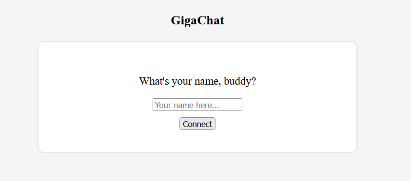
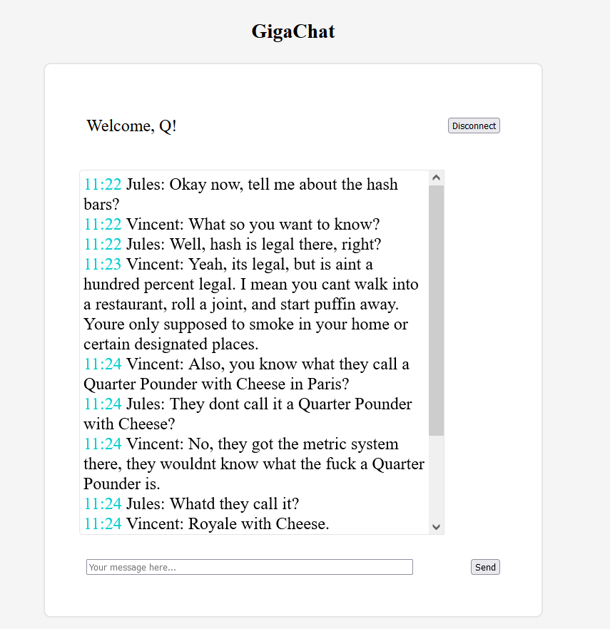

## Simple WebSocket chat application

### Intro
In this doc, you can find my experience of developing a web-based chat application.
User is able to choose their name, change it anytime, and post any text message to the chat.
Web sockets are used to connect to the server and get and send messages to other users.

### Stack
It is developed in `Java 17` with `Spring Boot` for a server, and `HTML/CSS/JS` and jQuery for a client.

### Begining
At first, I made a simple application in vanilla `Java 8` using `java.net.Socket` and `java.io.DataInput/OutputStream`.

There were to applications: `Server` and `Client`.

`Server` is listening to the specific port. When user connects, a new thread created for listening for their messages and redirecting them to all other clients.

`Server.listen(int port)`:

      private void listen(int port) throws IOException {
          ss = new ServerSocket(port);
          System.out.println("Listening on " + ss);

          while (true) {
              Socket s = ss.accept();
              System.out.println("Connection from " + s);
              DataOutputStream dout = new DataOutputStream(s.getOutputStream());
              socketOutputMap.put(s, dout);

              new ServerThread(this, s, db);
          }
      }
      
 `Logic of each Server connection`:
 
    @Override
    public void run() {
        try {
            DataInputStream din = new DataInputStream(socket.getInputStream());

            while (true) {
                String message = din.readUTF();
                System.out.println("Sending " + message);
                server.sendToAll(message);
            }
        } catch (Exception e) {
            e.printStackTrace();
            server.removeSocket(socket);
        }
    }
    
`Client` connects to the port, there is a loop which waits for their input messages and a thread for getting messages from other people.

`Client application logic`:

  public Client () {
        try {
            socket = new Socket("127.0.0.1", 5000);
            System.out.println( "connected to " + socket);
            din = new DataInputStream( socket.getInputStream() );
            dout = new DataOutputStream( socket.getOutputStream() );

            new Thread(this).start();

            // checks for user entered messages
            Scanner scanner = new Scanner(System.in);
            while (true) {
                String inputMessage = scanner.nextLine();
                if (!inputMessage.isEmpty() && !inputMessage.isBlank()) {
                    System.out.println(inputMessage);
                    dout.writeUTF(inputMessage);
                }
            }
    }

### Real work
To build a real web application with a client side in the browser,
I started by reading an official Spring framework guide "Using WebSocket to build an interactive web application".

Three big tasks were there:

1. Develop UI
1. Client
2. Backend

#### UI
Honestly, I am absolutely bad at building UIs.
Even this pretty small application was not adapted for mobile devices.
So, it took me some time to make a responsive UI with DOM.

Official example uses `bootstrap`, `stomp`, and `jsocks`, but, imho, it's an overkill for such small things.
Also, it would be easy not to use `jquery`, but I find it's selectors really convenient.

#### Client
Client logic is written in JS and jQuery.

When user writes their name and enters chat, [WebSocket](https://developer.mozilla.org/en-US/docs/Web/API/WebSocket) is being initialized and listener for messages from other users is established.

#### Backend
Backend is pretty simple here.
Everything is handled by Spring.
I have a SocketHandler wich takes users' messages and resends messages for each active `WebSocketSession`.

I also used SQLite as a repository.
It contains all sent messages.

### Hosting
For hosting, I rent a basic server with Ubuntu from DigitalOcean.
I use it for other projects, so I just ran this web app there.

### How to run
Maven is used in this project.
You can run the application by using `./mvnw spring-boot:run`.
Alternatively, you can build the JAR file with `./mvnw clean package` and then run the JAR file.
